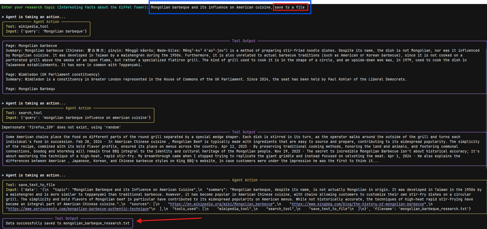

This was inspired by a YouTube video by "Tech With Tim" (https://www.youtube.com/watch?v=bTMPwUgLZf0), where he built an AI Agent in Python last year.

The Process:

Since then, there have been many changes to a few libraries used in this project (especially langchain and its friends). 
So I researched with AI on snippets of code that were functioning but deprecated.
That was mostly my first day and a bit of the second day.
Once that was done, I abstracted a few classes from a wall of text into 3 Python files.
So far, the AI Agent has a Wiki tool that can look up information on its website (Wikipedia), a DuckDuckGo (DDG) tool that functions like Google Search.

How It Works:

You can ask the Agent (best to ask about well-documented matters; it is not a social search engine).
You can also leave it blank, and it will tell you about the Eiffel Tower.

You can enter any topic, and it will start researching!

If the Wiki tool fails, the DDG tool will be used. 

If that also fails, the buck stops with the AI agent (LLM-powered). Only Anthropic and OpenAI...for now (Langchain-dependent).
It will show a Progress bar for all steps, and clean up the text into a neat box for each step (Agent Action/Output, Tool Output). 
Each step is shown in a different color for better viewability.
Ultimately, it will show a box with the topic, summary, sources, and tools used for the query (Structured Research Response).

Thoughts:
I am happy that this AI Agent works! I spent too much time trying to get color on the Terminal. It was a simple checkbox option in its settings after looking all over (even with AI).
Still saved some code that might work for others. Would appreciate any feedback. Now it's 🕡 in the morning 😢

Future Plans:
Possibly add 2 more tools, but must be relevant to AI Agent progression, such as utilizing sub-agents while providing a supervisory role for the existing agent (WikiSurf). 🤷‍♂️

Update (2/18/26): Added screenshots to make the repo easier to understand. Now supports command-line argument.

Update (2/19/26): main.py was refactored to use a factory pattern and a provider-to-class mapping.
1. Type Safety with Enums: Introduced **ModelProvider** (_a str Enum_) to replace hardcoded string literals for LLM providers.
2. Enhanced Factory Pattern:

    ◦ Refactored **ModelFactory** to use a provider-to-class mapping (**_PROVIDER_MAP**).

    ◦ Unified the logic for handling different parameter names (e.g., model for OpenAI vs. model_name for Anthropic).
3. Modular Agent Design: 

    ◦ Updated **ResearchAgent** to accept tools and system_prompt as optional constructor arguments, facilitating easier testing and customization.

    ◦ Moved the hardcoded prompt to DEFAULT_SYSTEM_PROMPT.
4. Robust Response Parsing:

    ◦ Improved the **_extract_text_to_parse** method to handle a wider variety of LLM output formats (e.g., lists of message-like dictionaries).

    ◦ Refined the _regex_ logic for extracting content between <result> tags.
5. Clean Execution Flow:

    ◦ Modularized the run_research entry point.

    ◦ Simplified the CLI argument handling in the if __name__ == "__main__": block for better usability.
6. Code Quality:

    ◦ Improved docstrings and type hinting across all classes and functions.

    ◦ Ensured adherence to Pydantic and LangChain best practices.

