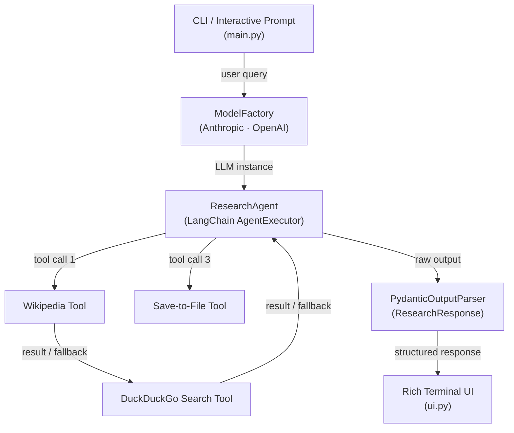

# WikiSurf — AI-Powered Research Agent

An autonomous research agent that accepts a natural-language topic, orchestrates multiple search tools in priority order, and returns a structured summary with cited sources — all rendered in a rich terminal UI.

> **Inspired by** [Tech With Tim — Build an AI Agent in Python](https://www.youtube.com/watch?v=bTMPwUgLZf0)

---

## Architecture


```mermaid
flowchart TD
    CLI["CLI / Interactive Prompt\n(main.py)"]
    Factory["ModelFactory\n(Anthropic · OpenAI)"]
    Agent["ResearchAgent\n(LangChain AgentExecutor)"]
    WikiTool["Wikipedia Tool"]
    DDGTool["DuckDuckGo Search Tool"]
    SaveTool["Save-to-File Tool"]
    Parser["PydanticOutputParser\n(ResearchResponse)"]
    UI["Rich Terminal UI\n(ui.py)"]

    CLI -->|user query| Factory
    Factory -->|LLM instance| Agent
    Agent -->|tool call 1| WikiTool
    WikiTool -->|result / fallback| DDGTool
    DDGTool -->|result / fallback| Agent
    Agent -->|tool call 3| SaveTool
    Agent -->|raw output| Parser
    Parser -->|structured response| UI
```

**Execution flow:**
1. The user supplies a research topic via the CLI or the interactive prompt.
2. `ModelFactory` instantiates the chosen LLM (Anthropic or OpenAI) from environment settings.
3. `ResearchAgent` runs the LangChain `AgentExecutor`, which calls tools in priority order: Wikipedia → DuckDuckGo → LLM fallback.
4. The raw output is parsed into a typed `ResearchResponse` (topic, summary, sources, tools used).
5. `ui.py` renders each agent step in a colour-coded panel, a progress bar, and a final structured results box.

---

## Features

- **Multi-tool orchestration** — Wikipedia is queried first; DuckDuckGo serves as an automatic fallback; the LLM itself acts as a last-resort knowledge source.
- **Structured output** — responses are validated against a Pydantic schema and always include topic, summary, sources, and tools used.
- **Provider flexibility** — swap between Anthropic (Claude) and OpenAI (GPT-4o) via a single enum argument; model names are configurable in `.env`.
- **Rich terminal UI** — colour-coded agent steps, a live progress spinner, and formatted result panels powered by the `rich` library.
- **Persistent output** — the `save_text_to_file` tool appends timestamped research results to a local text file.
- **CLI support** — pass a topic directly as a command-line argument or enter it interactively.

---

## Tech Stack

| Layer | Technology | Purpose |
|---|---|---|
| **Language** | Python 3.11+ | Core runtime |
| **Agent Framework** | LangChain (`langchain`, `langchain-classic`) | Agent orchestration, tool-calling, prompt templating |
| **LLM Providers** | `langchain-anthropic`, `langchain-openai` | Claude & GPT-4o integration |
| **Search Tools** | `langchain-community`, `wikipedia`, `duckduckgo-search` | Wikipedia & DuckDuckGo tool wrappers |
| **Data Validation** | `pydantic`, `pydantic-settings` | Typed response schema & environment config |
| **Terminal UI** | `rich`, `pygments` | Colour-coded panels, progress bars, syntax highlighting |
| **Config** | `python-dotenv` | API key management via `.env` |

---

## Getting Started

### Prerequisites
- Python 3.11+
- An Anthropic **or** OpenAI API key

### Installation

```bash
git clone https://github.com/your-username/WikiSurf.git
cd WikiSurf
python -m venv .venv
.venv\Scripts\activate        # Windows
pip install -r requirements.txt
```

### Configuration

Create a `.env` file in the project root:

```env
ANTHROPIC_API_KEY=your_anthropic_key_here
OPENAI_API_KEY=your_openai_key_here        # optional
```

### Usage

```bash
# Interactive prompt (defaults to Eiffel Tower if left blank)
python main.py

# Pass a topic directly
python main.py Mongolian barbeque history
```

---

## Screenshots

**Interactive prompt**


**Agent researching a topic (Wikipedia tool)**


**DuckDuckGo fallback in action**


**Structured Research Response**


**CLI argument support**


---

## Project Structure

```
WikiSurf/
├── main.py           # ModelFactory, ResearchAgent, entry point
├── tools.py          # Wikipedia, DuckDuckGo, and file-save tool definitions
├── ui.py             # Rich terminal UI components and callback handler
├── requirements.txt  # Python dependencies
├── .env              # API keys (not committed)
└── Images and Text/  # Sample output and screenshots
```

---

## Key Technical Decisions

| Decision | Rationale |
|---|---|
| **Factory pattern** (`ModelFactory`) | Decouples LLM instantiation from agent logic; adding a new provider requires only a single map entry |
| **`ModelProvider` str Enum** | Eliminates hardcoded string literals and provides IDE autocompletion and type safety |
| **Pydantic schema for output** | Guarantees a consistent, validated response structure regardless of LLM verbosity or formatting variations |
| **Callback-based UI updates** | LangChain callbacks allow the UI layer to react to each agent step without coupling it to core logic |
| **Tool priority fallback chain** | Maximises the likelihood of a high-quality, sourced answer before falling back to the LLM's parametric knowledge |

---

## Changelog

**2026-02-19** — Refactored `main.py` with `ModelProvider` enum, enhanced `ModelFactory`, modular `ResearchAgent` constructor, improved `<result>` tag parsing, and strengthened type hints and docstrings throughout.

**2026-02-18** — Added screenshots; introduced command-line argument support.

---

## Roadmap

- [ ] Add sub-agent support (supervisor + specialist agents) to handle multi-step, multi-domain queries.
- [ ] Expand LLM provider support beyond Anthropic and OpenAI (currently constrained by LangChain's tool-calling interface).
- [ ] Integrate additional specialised tools (e.g., arXiv, news APIs) to broaden research coverage.
